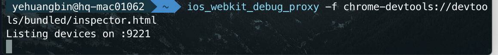
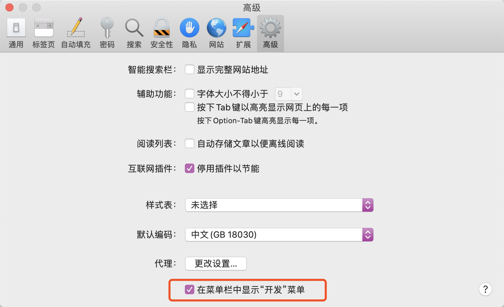
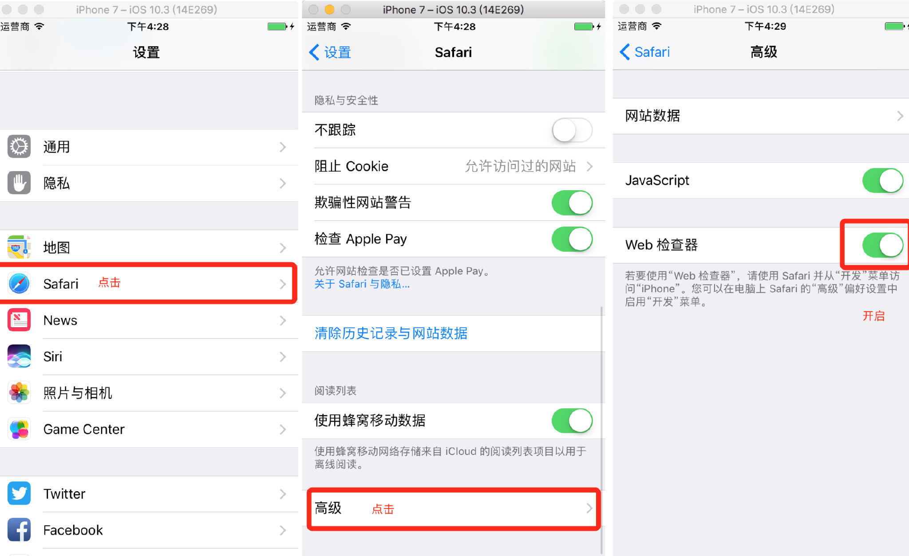
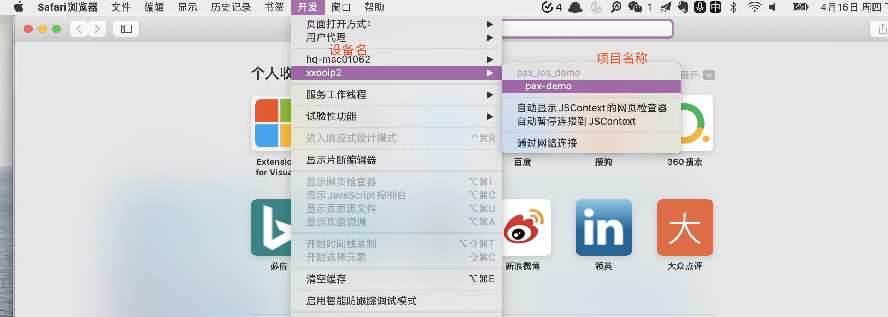
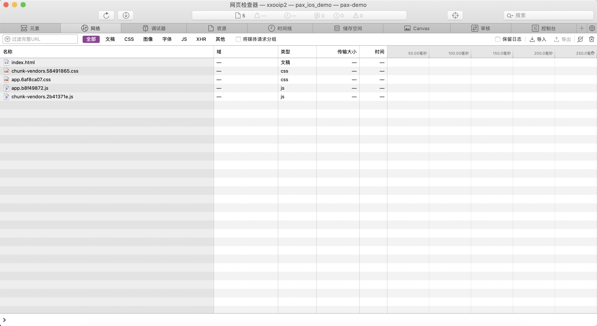

# H5-iOS基于Mac环境调试方案


## 纯H5

推荐使用 Chrome 进行调试（支持React等插件），先在终端安装 ios-webkit-debug-proxy 工具，可执行命令： 

``` brew install ios-webkit-debug-proxy```

安装完成启动，启动Proxy，即可在9221端口监听：

```ios_webkit_debug_proxy -f chrome-devtools://devtools/bundled/inspector.html```




打开 http://localhost:9221/ ，即可看到我们的设备，点击后即可调试设备上Safari/Chrome当前访问的H5页面。


如果出现页面未显示已连接设备，可执行以下命令重新安装下环境。

```
brew uninstall --force libimobiledevice ios-webkit-debug-proxy
brew install --HEAD libimobiledevice ios-webkit-debug-proxy
```


## App内H5

使用Safari浏览器进行调试，需先开启开发菜单。在Safari浏览器的编号设置 -> 高级 中勾选开发菜单：



手机中开启safari web检查器选项：



使用Xcode 运行 App 后即可在开发菜单中看到响应信息。







## ios-webkit-debug-proxy （chrome）

