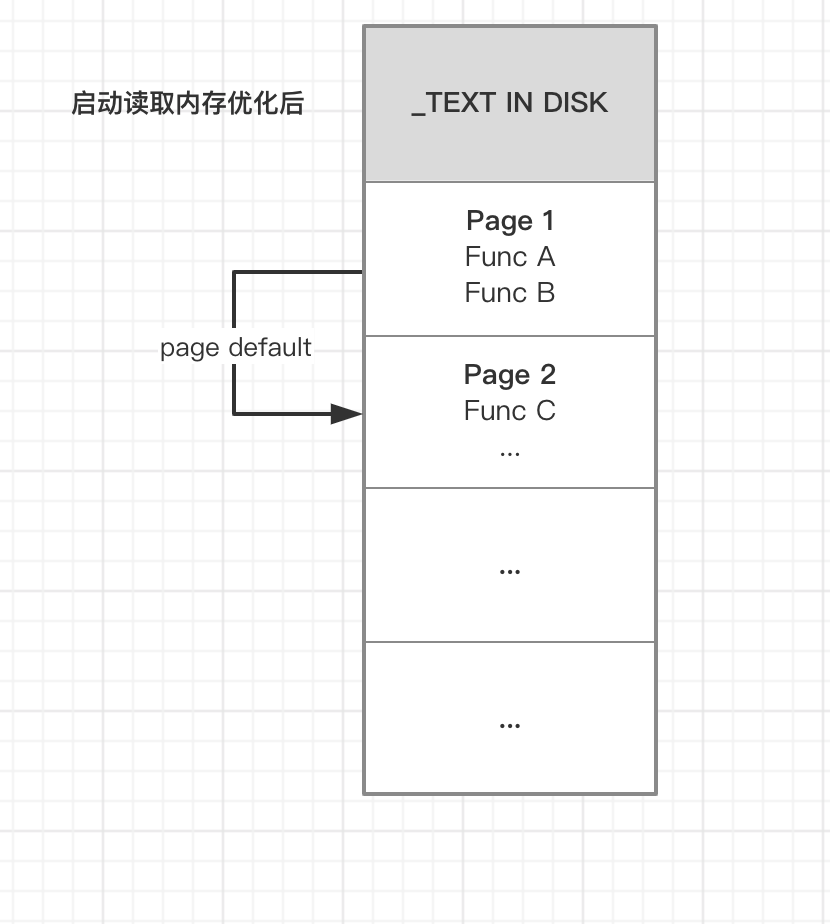
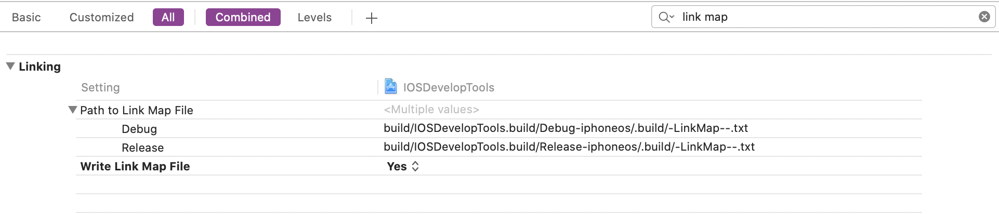
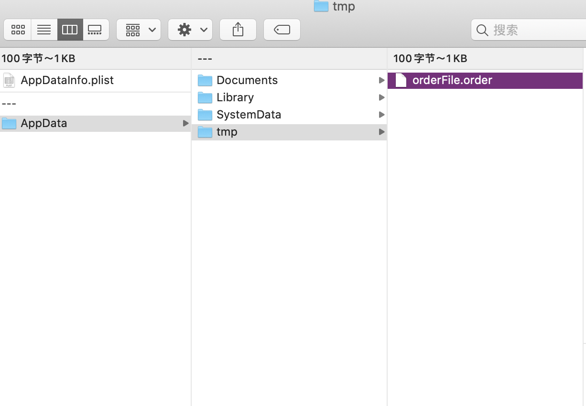

# 二进制重排

## 介绍

去年年底二进制重排的概念被宇宙厂带火了起来，出于学习的目的，综合网上已有资料并总结实现了下，以便对启动优化有更好的了解。

### App启动和内存加载

Linux 系统下，进程申请内存并不是直接物理内存给我们运行，而是只标记当前进程拥有该段内存，当真正使用这段段内存时才会分配，此时的内存是虚拟内存。

当我们需要访问一个内存地址时，如果虚拟内存地址对应的物理内存还未分配，CPU 会执行 `page fault`，将指令从磁盘加载到物理内存中并进行验签操作（App Store 发布情况下）。

在App 启动过程中，会调用各种函数，由于这些函数分布在各个 TEXT 段中且不连续，此时需要执行多次 `page fault` 创建分页，将代码读取到物理内存中，并且这些分页中的部分代码不会在启动阶段被调用。如下图所示，假设我们在启动阶段需要调用 `Func A、B、C`，则需执行3次 `page default`(包括首次读取)，并使用3个分页。


### 如何优化？

优化的思路很简单，即把启动阶段需要用到的函数按顺序排放，减少 `page fault` 执行次数和分页数量，并使 `page fault` 在相邻页执行，如下图所示，相较于之前，减少了一次 `page fault` 和分页加载，当工程复杂度高时，优化的效果就很客观了。




Xcode 的链接器提供了一个 `Order File` 配置，对应的文件中符号会按照顺序写入二进制文件中，我们可以将调用到的函数写到该文件，实现优化。


## 实现详解

### Link Map了解链接顺序

Link Map 是 App 编译过程的中间产物，记载了二进制文件的布局，我们可以通过 Link Map 文件分析可执行文件的构成是怎样，里面的内容都是些什么，哪些库占用空间较高等等，需要手动在 Build Settings 将 Write Link Map File 设置为 Yes。  

默认生成的 Link Map 文件在 build 目录下，可以通过修改 Path To Link Map 指定存放地址。



以demo为例，文件中的内容如下，各部位含义见注释：

```
// Link Map对应安装包地址
# Path: /Users/yehuangbin/Library/Developer/Xcode/DerivedData/IOSDevelopTools-bpjwhcswecoziihayzwjgxztowne/Build/Products/Debug-iphoneos/IOSDevelopTools.app/IOSDevelopTools

// 对应的架构
# Arch: arm64

// 编译后生成的.o文件列表，包括系统和用户自定的类，UIKit库等等。
# Object files:
[  0] linker synthesized
[  1] /Users/yehuangbin/Library/Developer/Xcode/DerivedData/IOSDevelopTools-bpjwhcswecoziihayzwjgxztowne/Build/Intermediates.noindex/IOSDevelopTools.build/Debug-iphoneos/IOSDevelopTools.build/Objects-normal/arm64/YECallMonitor.o
[  2] /Users/yehuangbin/Library/Developer/Xcode/DerivedData/IOSDevelopTools-bpjwhcswecoziihayzwjgxztowne/Build/Intermediates.noindex/IOSDevelopTools.build/Debug-iphoneos/IOSDevelopTools.build/Objects-normal/arm64/YECallRecordCell.o
[  3] /Users/yehuangbin/Library/Developer/Xcode/DerivedData/IOSDevelopTools-bpjwhcswecoziihayzwjgxztowne/Build/Intermediates.noindex/IOSDevelopTools.build/Debug-iphoneos/IOSDevelopTools.build/Objects-normal/arm64/YECallRecordModel.o
[  4] /Users/yehuangbin/Library/Developer/Xcode/DerivedData/IOSDevelopTools-bpjwhcswecoziihayzwjgxztowne/Build/Intermediates.noindex/IOSDevelopTools.build/Debug-iphoneos/IOSDevelopTools.build/Objects-normal/arm64/YECallTraceCore.o
[  5] /Users/yehuangbin/Library/Developer/Xcode/DerivedData/IOSDevelopTools-bpjwhcswecoziihayzwjgxztowne/Build/Intermediates.noindex/IOSDevelopTools.build/Debug-iphoneos/IOSDevelopTools.build/Objects-normal/arm64/fishhook.o
[  6] /Users/yehuangbin/Library/Developer/Xcode/DerivedData/IOSDevelopTools-bpjwhcswecoziihayzwjgxztowne/Build/Intermediates.noindex/IOSDevelopTools.build/Debug-iphoneos/IOSDevelopTools.build/Objects-normal/arm64/ViewController.o
...

// Section是各种数据类型所在的内存空间，Section主要分为两大类，__Text和__DATA。__Text指的是程序代码，__DATA指的是已经初始化的变量等。
# Sections:
# Address	Size    	Segment	Section
0x10000572C	0x0000B184	__TEXT	__text
0x1000108B0	0x000002C4	__TEXT	__stubs
0x100010B74	0x000002DC	__TEXT	__stub_helper
0x100010E50	0x00000088	__TEXT	__const
0x100010ED8	0x000006EC	__TEXT	__cstring
0x1000115C4	0x000019EF	__TEXT	__objc_methname
0x100012FB4	0x00000134	__TEXT	__ustring
0x1000130E8	0x000000F6	__TEXT	__objc_classname
0x1000131DE	0x00000CBF	__TEXT	__objc_methtype
0x100013EA0	0x00000160	__TEXT	__unwind_info
0x100014000	0x00000030	__DATA	__got
0x100014030	0x000001D8	__DATA	__la_symbol_ptr
0x100014208	0x000001C0	__DATA	__const
0x1000143C8	0x000004A0	__DATA	__cfstring
0x100014868	0x00000038	__DATA	__objc_classlist
0x1000148A0	0x00000008	__DATA	__objc_catlist
0x1000148A8	0x00000028	__DATA	__objc_protolist
...

// 变量名、类名、方法名等符号表
# Symbols:
# Address	Size    	File  Name
0x10000572C	0x00000080	[  1] +[YECallMonitor shareInstance]
0x1000057AC	0x0000005C	[  1] ___30+[YECallMonitor shareInstance]_block_invoke
0x100005808	0x00000024	[  1] -[YECallMonitor start]
0x10000582C	0x00000024	[  1] -[YECallMonitor stop]
0x100005850	0x00000200	[  1] -[YECallMonitor getThreadCallRecord]
0x100005A50	0x000002F8	[  1] ___36-[YECallMonitor getThreadCallRecord]_block_invoke
0x100005D48	0x000000A4	[  1] ___copy_helper_block_e8_32s40s48s
0x100005DEC	0x00000068	[  1] ___destroy_helper_block_e8_32s40s48s
0x100005E54	0x0000002C	[  1] -[YECallMonitor setDepth:]
0x100005E80	0x0000002C	[  1] -[YECallMonitor setMinTime:]
0x100005EAC	0x00000024	[  1] -[YECallMonitor clear]
0x100005ED0	0x00000028	[  1] -[YECallMonitor enable]
0x100005EF8	0x0000026C	[  1] -[YECallMonitor setFilterClassNames:]
0x100006164	0x00000230	[  1] -[YECallMonitor findStartDepthIndex:arr:]
0x100006394	0x00000610	[  1] -[YECallMonitor recursive_getRecord:]
0x1000069A4	0x00000240	[  1] -[YECallMonitor setRecordDic:record:]
...


# Dead Stripped Symbols:
#        	Size    	File  Name
<<dead>> 	0x00000008	[  2] 8-byte-literal
<<dead>> 	0x00000006	[  2] literal string: depth
<<dead>> 	0x00000012	[  2] literal string: stringWithFormat:
<<dead>> 	0x00000007	[  2] literal string: string
<<dead>> 	0x00000034	[  2] literal string: stringByPaddingToLength:withString:startingAtIndex:
<<dead>> 	0x0000000E	[  2] literal string: appendString:
<<dead>> 	0x00000004	[  2] literal string: cls
<<dead>> 	0x0000000E	[  2] literal string: .cxx_destruct
<<dead>> 	0x00000002	[  2] literal string: +
<<dead>> 	0x00000002	[  2] literal string: -
<<dead>> 	0x00000020	[  2] CFString
<<dead>> 	0x00000020	[  2] CFString
<<dead>> 	0x0000000B	[  2] literal string: v24@0:8@16
<<dead>> 	0x00000008	[  2] literal string: @16@0:8
<<dead>> 	0x00000008	[  2] literal string: v16@0:8
<<dead>> 	0x00000005	[  3] literal string: init
<<dead>> 	0x0000000A	[  3] literal string: setDepth:
<<dead>> 	0x00000006	[  3] literal string: class
<<dead>> 	0x00000004	[  3] literal string: cls
<<dead>> 	0x00000004	[  3] literal string: sel
<<dead>> 	0x00000009	[  3] literal string: costTime
<<dead>> 	0x00000006	[  3] literal string: depth
<<dead>> 	0x00000006	[  3] literal string: total
<<dead>> 	0x0000000A	[  3] literal string: callCount
<<dead>> 	0x00000022	[  3] literal string: initWithCls:sel:time:depth:total:
...


```

可以看到此时 Symbols 的符号表并不是按照启动时执行的函数顺序加载的，而是按照库的编译顺序全部载入。


### SanitizerCoverage采集调用函数信息

SanitizerCoverage内置在LLVM中，可以在函数、基本块和边界这些级别上插入对用户定义函数的回调，详细介绍可以再 [Clang 11 documentation](http://clang.llvm.org/docs/index.html) 找到。

在 build settings 里的 “Other C Flags” 中添加 `-fsanitize-coverage=func,trace-pc-guard`。如果含有 Swift 代码的话，还需要在 “Other Swift Flags” 中加入 `-sanitize-coverage=func` 和 `-sanitize=undefined`。需注意，所有链接到 App 中的二进制都需要开启 SanitizerCoverage，这样才能完全覆盖到所有调用。

开启后，函数的调用会执行 `void __sanitizer_cov_trace_pc_guard(uint32_t *guard) {}` 回调，我们可在该回调中插入自己的统计代码，收集函数名，启动完成后再将数据导出。借鉴[玉令天下](http://yulingtianxia.com/)的实现代码，稍微修改了下，如需自取 [AppCallCollecter](https://github.com/SimonYHB/iOS-Develop-Tools/tree/master/IOSDevelopTools/AppCallCollecter)，代码如下：

```c


static OSQueueHead qHead = OS_ATOMIC_QUEUE_INIT;
static BOOL stopCollecting = NO;

typedef struct {
    void *pointer;
    void *next;
} PointerNode;

void __sanitizer_cov_trace_pc_guard_init(uint32_t *start,
                                         uint32_t *stop) {
    static uint32_t N;  // Counter for the guards.
    if (start == stop || *start) return;  // Initialize only once.
    printf("INIT: %p %p\n", start, stop);
    for (uint32_t *x = start; x < stop; x++)
        *x = ++N;  // Guards should start from 1.
}

// This callback is inserted by the compiler on every edge in the
// control flow (some optimizations apply).
// Typically, the compiler will emit the code like this:
//    if(*guard)
//      __sanitizer_cov_trace_pc_guard(guard);
// But for large functions it will emit a simple call:
//    __sanitizer_cov_trace_pc_guard(guard);
void __sanitizer_cov_trace_pc_guard(uint32_t *guard) {
    // If initialization has not occurred yet (meaning that guard is uninitialized), that means that initial functions like +load are being run. These functions will only be run once anyways, so we should always allow them to be recorded and ignore guard
    if (stopCollecting) {
        return;
    }
    // If you set *guard to 0 this code will not be called again for this edge.
    // Now you can get the PC and do whatever you want:
    //   store it somewhere or symbolize it and print right away.
    // The values of `*guard` are as you set them in
    // __sanitizer_cov_trace_pc_guard_init and so you can make them consecutive
    // and use them to dereference an array or a bit vector.
    *guard = 0;
    // __builtin_return_address 获取当前调用栈信息，取第一帧地址
    void *PC = __builtin_return_address(0);
    PointerNode *node = malloc(sizeof(PointerNode));
    *node = (PointerNode){PC, NULL};
    OSAtomicEnqueue(&qHead, node, offsetof(PointerNode, next));

    
}

extern NSArray <NSString *> *getAllFunctions(NSString *currentFuncName) {
    NSMutableSet<NSString *> *unqSet = [NSMutableSet setWithObject:currentFuncName];
    NSMutableArray <NSString *> *functions = [NSMutableArray array];
    while (YES) {
        PointerNode *front = OSAtomicDequeue(&qHead, offsetof(PointerNode, next));
        if(front == NULL) {
            break;
        }
        Dl_info info = {0};
        // dladdr获取地址符号信息
        dladdr(front->pointer, &info);
        NSString *name = @(info.dli_sname);
        if([unqSet containsObject:name]) {
            continue;
        }
        BOOL isObjc = [name hasPrefix:@"+["] || [name hasPrefix:@"-["];
        NSString *symbolName = isObjc ? name : [@"_" stringByAppendingString:name];
        [unqSet addObject:name];
        [functions addObject:symbolName];
    }
    return [[functions reverseObjectEnumerator] allObjects];;

}

#pragma mark - public

extern NSArray <NSString *> *getAppCalls(void) {
    
    stopCollecting = YES;
    // 内存屏障，防止cpu的乱序执行调度内存（原子锁）
    __sync_synchronize();
    NSString* curFuncationName = [NSString stringWithUTF8String:__FUNCTION__];
    return getAllFunctions(curFuncationName);
}


extern void appOrderFile(void(^completion)(NSString* orderFilePath)) {
    
    stopCollecting = YES;
    __sync_synchronize();
   NSString* curFuncationName = [NSString stringWithUTF8String:__FUNCTION__];
    
    dispatch_after(dispatch_time(DISPATCH_TIME_NOW, (int64_t)(0.01 * NSEC_PER_SEC)), dispatch_get_global_queue(DISPATCH_QUEUE_PRIORITY_DEFAULT, 0), ^{
        NSArray *functions = getAllFunctions(curFuncationName);
        NSString *orderFileContent = [functions.reverseObjectEnumerator.allObjects componentsJoinedByString:@"\n"];
        NSLog(@"[orderFile]: %@",orderFileContent);
        NSString *filePath = [NSTemporaryDirectory() stringByAppendingPathComponent:@"orderFile.order"];
        [orderFileContent writeToFile:filePath
                           atomically:YES
                             encoding:NSUTF8StringEncoding
                                error:nil];
        if(completion){
            completion(filePath);
        }
    });
}
```

在项目启动后调用 `appOrderFile` 方法，将调用列表写到沙盒中，通过在 Devices 下载 xcappdata 文件即可获取该列表。




里面的内容即是启动过程被调用的函数顺序。

```c
_getThreadMethodStack
_after_objc_msgSend
_before_objc_msgSend
-[YECallMonitor ignoreClassArr]
-[YECallMonitor setFilterClassNames:]
_get_protection
_perform_rebinding_with_section
_rebind_symbols_for_image
__rebind_symbols_for_image
_prepend_rebindings
_rebind_symbols
___startMonitor_block_invoke
_startMonitor
-[YECallMonitor start]
_setMinConsumeTime
-[YECallMonitor setMinTime:]
___30+[YECallMonitor shareInstance]_block_invoke
+[YECallMonitor shareInstance]
-[AppDelegate application:didFinishLaunchingWithOptions:]
-[AppDelegate setWindow:]
-[AppDelegate window]
_main
```

最后在 `Order File` 配置下文件地址，重新编译打包。


### 结果对比

从重排后的 Link Map Symbols 部分可以看到此时的载入顺序跟我们的 order file 文件是一致的。

```
...
# Symbols:
# Address	Size    	File  Name
0x100007CCC	0x000000AC	[  4] _getThreadMethodStack
0x100007D78	0x00000234	[  4] _after_objc_msgSend
0x100007FAC	0x0000016C	[  4] _before_objc_msgSend
0x100008118	0x000001AC	[  1] -[YECallMonitor ignoreClassArr]
0x1000082C4	0x00000298	[  1] -[YECallMonitor setFilterClassNames:]
0x10000855C	0x000000A0	[  5] _get_protection
0x1000085FC	0x000003D0	[  5] _perform_rebinding_with_section
0x1000089CC	0x00000320	[  5] _rebind_symbols_for_image
0x100008CEC	0x00000058	[  5] __rebind_symbols_for_image
0x100008D44	0x00000104	[  5] _prepend_rebindings
0x100008E48	0x000000F8	[  5] _rebind_symbols
0x100008F40	0x000000E0	[  4] ___startMonitor_block_invoke
0x100009020	0x00000074	[  4] _startMonitor
0x100009094	0x00000044	[  1] -[YECallMonitor start]
0x1000090D8	0x00000044	[  4] _setMinConsumeTime
0x10000911C	0x00000054	[  1] -[YECallMonitor setMinTime:]
0x100009170	0x00000074	[  1] ___30+[YECallMonitor shareInstance]_block_invoke
0x1000091E4	0x0000009C	[  1] +[YECallMonitor shareInstance]
0x100009280	0x00000208	[ 11] -[AppDelegate application:didFinishLaunchingWithOptions:]
0x100009488	0x00000070	[ 11] -[AppDelegate setWindow:]
0x1000094F8	0x00000058	[ 11] -[AppDelegate window]
0x100009550	0x000000D4	[  9] _main
...
```

通过 system trace 工具对比下优化前后的启动速度，由于 Demo 工程内容少，无法看出明显区别，这里用公司项目作为对比：


可以看到执行 `page fault` 少了将近 1/3，速度提升了 1/4，说明对启动优化上还是有一定效果，尤其是在大项目中。

## 总结

网上还有其他方案来实现二进制重排，抖音通过手动插桩获取的符号数据（包括C++静态初始化、+Load、Block等）会更加准确，但就其复杂度来说感觉性价比不高，而手淘的方案比较特殊，通过修改 .o 目标文件实现静态插桩，需要对目标代码较为熟悉，通用性不高。  

由于在 iOS 上，一页有16KB（Mac 为4KB），可以存放大量代码，所以在启动阶段执行 `page fault` 的次数并不会很多，二进制重排相比于其他优化手段，提升效果不明显，应优先从其他方面去进行启动优化（关于这部分的文章近期就会发布），最后再考虑是否做重排优化，但从技术学习的层面还是值得研究的 😁。


### 参考

- [Improving App Performance with Order Files](https://medium.com/@michael.eisel/improving-app-performance-with-order-files-c7fff549907f)
- [App 二进制文件重排已经被玩坏了](http://yulingtianxia.com/blog/2019/09/01/App-Order-Files/)
- [简谈二进制重排](http://www.cocoachina.com/articles/52793)
- [基于LinkMap分析iOSAPP各模块体积](https://blog.csdn.net/zgzczzw/article/details/79855660)
- [手淘架构组最新实践 | iOS基于静态库插桩的⼆进制重排启动优化](https://mp.weixin.qq.com/s/YDO0ALPQWujuLvuRWdX7dQ)
- [抖音研发实践：基于二进制文件重排的解决方案 APP启动速度提升超15%](https://mp.weixin.qq.com/s?__biz=MzI1MzYzMjE0MQ==&mid=2247485101&idx=1&sn=abbbb6da1aba37a04047fc210363bcc9&scene=21#wechat_redirect)


### About Me  🐝

今年计划完成10个优秀第三方源码解读，会陆续提交到 [iOS-Framework-Analysis](https://github.com/SimonYHB/iOS-Framework-Analysis) ，欢迎 star 项目陪伴笔者一起提高进步，若有什么不足之处，敬请告知 🏆。