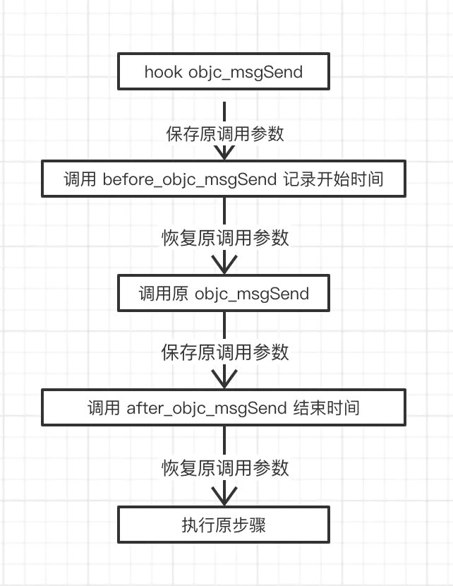

# 实现objc_msgSend的耗时监控

## 前言

如果有这么一个需求，要监控所有OC方法的耗时时间，我们要如何实现？本文将描述如何利用 fishhook 去拦截底层的 objc_msgSend 实现，从而达到监控所有 OC 方法的目的。

Ps: 本文不涉及 objc_msgSend 源码解析，只专注于 Hook及耗时统计。对其底层实现有兴趣的可以查看 [arm64下Objc_msgSend的实现注释](https://github.com/SimonYHB/iOS-Framework-Analysis/blob/master/framework/objc-msg-arm64/arm64下objc_msgSend汇编实现.md) ，已详细注释了每句汇编代码。

## 基础知识

在开始之前，需要先了解些基础知识，有便于后续的阅读。

### Fishhook

**fishhook**是facebook开源的老牌Hook框架，相比于利用消息转发机制实现 Method Swizzle，其在 dylib 链接 Mach-O 时，更改动态绑定地址，能实现系统C/C++函数的Hook，具体可查看笔者之前写的 [Hook利器之fishhook](https://juejin.im/post/5e62275cf265da570e39ae46)。

### arm64基础知识

由于 Objc_msgSend 使用汇编实现，所以我们需要学习些会用到的汇编指令，才能清晰的知道每一步在做什么。

arm64 有64位处理器，能同时处理64位数据，其每条指令固定长度为32bit，即4个字节。

#### arm64 有34个寄存器，其中包括31个通用寄存器、SP、PC、CPSR。

- x0-x30

  通常 x0 – x7 分别会存放方法的前 8 个参数，如果参数个数超过了8个，多余的参数会存在栈上，新方法会通过栈来读取。

  当方法有返回值时，执行结束会将结果放在 x0 上，如果方法返回值是一个较大的数据结构时，结果则会存在 x8 执行的地址上。

  x29 又称为FP，用于保存栈底地址。

  x30 寄存器又称为**LR**，用于保存要执行的下一条指令，后面我们 Hook 时需要多次存取该寄存器。

  w0-w30 表示访问其低32位寄存器

- SP(x30)

  栈寄存器，在任意时刻会保存我们栈顶的地址，后面我们会通过偏移它来暂存参数。

- PC(x31)

  存放当前执行的指令的地址，不可被修改。

- **SPRs**

  SPRs是状态寄存器，用于存放程序运行中一些状态标识。不同于编程语言里面的if else.在汇编中就需要根据状态寄存器中的一些状态来控制分支的执行。状态寄存器又分为 The Current Program Status Register (CPSR)  和 The Saved Program Status Registers (SPSRs)。 一般都是使用 CPSR， 当发生异常时， CPSR 会存入 SPSR 。当异常恢复，再拷贝 CPSR。了解即可。

### 会用到的汇编指令

| 指令       | 作用                                             |
| ---------- | ------------------------------------------------ |
| mov        | 用寄存器之间的赋值                               |
| str、stp   | 存储指令，用于将一个/一对寄存器的数据写入内存中  |
| ldr、ldp   | 加载指令，用于从内存读取一个/一对数据到寄存器    |
| b、bl、blr | 跳转指令，分别是不带返回、带返回、带返回并指定pc |
| ret        | *子程序返回指令，返回地址默认保存在LR（X30）*    |

另外还有ADD、SUB、AND、CBZ等指令，在objc_msgSend源码里会用到，这里不涉及就不具体阐述了，有兴趣的可搜下arm64指令集。

在Xcode编写汇编需要用到 GCC内嵌汇编，有兴趣可以看下 [ARM GCC内嵌](http://blog.chinaunix.net/uid-20543672-id-3194385.html)， 仅做了解。


## 设计流程

设计思路: 当我们要统计函数的耗时，最直接的方式就是记录执行函数前和执行函数后的时间，差值就是所消耗时间。

- 使用 fishihook 对 objc_msgSend 进行替换，实现自己的 hook_objc_msgSend
- 通过汇编代码将调用时寄存器中的参数保存和恢复
- 实现调用前后的计时方法 before_objc_msgSend 和 after_objc_msgSend




由于存在多层级 objc_msgSend 调用，所以需要涉及一个调用栈来保存调用层级和起始时间。调用before_objc_msgSend时，都将最新的调用指令进行入栈操作，记录当前时间和调用层级，调用after_objc_msgSend时取出栈顶元素，即可得到方法及对应的耗时。


## 具体代码

### 设计调用栈及初始化变量

```objective-c
//用于记录方法
typedef struct {
    Class cls;
    SEL sel;
    uint64_t time;
    uintptr_t lr; // lr寄存器内的地址值
} MethodRecord;

//主线程方法调用栈
typedef struct {
    MethodRecord *stack;
    int allocCount; //栈内最大可放元素个数
    int index; //当前方法的层级
    bool isMainThread;
} ThreadMethodStack;


static id (*orgin_objc_msgSend)(id, SEL, ...);
static pthread_key_t threadStackKey;

static YEThreadCallRecord *threadCallRecords = NULL;
static int recordsCurrentCount;
static int recordsAllocCount;

static int maxDepth = 3; // 设置记录的最大层级
static uint64_t minConsumeTime = 1000; // 设置记录的最小耗时


```

定义两个结构体来构成我们的调用栈。

### 对 objc_msgSend 进行拦截

````objective-c
void startMonitor(void) {
    static dispatch_once_t onceToken;
    dispatch_once(&onceToken, ^{
        pthread_key_create(&threadStackKey, cleanThreadStack);
        struct rebinding rebindObjc_msgSend;
        rebindObjc_msgSend.name = "objc_msgSend";
        rebindObjc_msgSend.replacement = hook_objc_msgSend;
        rebindObjc_msgSend.replaced = (void *)&orgin_objc_msgSend;
        struct rebinding rebs[1] = {rebindObjc_msgSend};
        rebind_symbols(rebs, 1);
    });
}

// 线程私有数据的清理函数
void cleanThreadStack(void *ptr) {
    if (ptr != NULL) {
        ThreadMethodStack *threadStack = (ThreadMethodStack *)ptr;
        if (threadStack->stack) {
            free(threadStack->stack);
        }
        free(threadStack);
    }
}

// 获取当前线程的调用栈
ThreadMethodStack* getThreadMethodStack() {
    
    ThreadMethodStack *tms = (ThreadMethodStack *)pthread_getspecific(threadStackKey);
    if (tms == NULL) {
        tms = (ThreadMethodStack *)malloc(sizeof(ThreadMethodStack));
        tms->stack = (MethodRecord *)calloc(128, sizeof(MethodRecord));
        tms->allocLength = 64;
        tms->index = -1;
        tms->isMainThread = pthread_main_np();
        pthread_setspecific(threadStackKey, tms);
    }
    return tms;
}
````

由于 objc_msgSend 会在多个线程被调用，所以需要让保证当前线程的调用栈不被其他线程修改，这时就用到了  `pthread_key_create` 线程私有数据概念，关于这部分内容可查看笔者之前的文章 [什么是线程私有数据](https://juejin.im/post/5e55e470f265da574657d615) 。

利用 fishhook 提供的 api 将 objc_msgSend 替换成我们的 hook_objc_msgSend， 并创建一个key为 _thread_key 线程私有数据方便后续存放调用栈。

### 实现自定义 hook_objc_msgSend

```c

void before_objc_msgSend(id self, SEL _cmd, uintptr_t lr) {
    ThreadMethodStack *tms = getThreadMethodStack();
    if (tms) {
        int nextIndex = (++tms->index);
        if (nextIndex >= tms->allocCount) {
            tms->allocCount += 64;
            tms->stack = (MethodRecord *)realloc(tms->stack, tms->allocCount * sizeof(MethodRecord));
        }
        MethodRecord *newRecord = &tms->stack[nextIndex];
        newRecord->cls = object_getClass(self);
        newRecord->sel = _cmd;
        newRecord->lr = lr;
        if (tms->isMainThread) {
            struct timeval now;
            gettimeofday(&now, NULL);
            newRecord->time = (now.tv_sec % 100) * 1000000 + now.tv_usec;
        }
    }
}

uintptr_t after_objc_msgSend() {
    ThreadMethodStack *tms = getThreadMethodStack();
    int curIndex = tms->index;
    int nextIndex = tms->index--;
    MethodRecord *record = &tms->stack[nextIndex];
    
    if (tms->isMainThread) {
        struct timeval now;
        gettimeofday(&now, NULL);
        uint64_t time = (now.tv_sec % 100) * 1000000 + now.tv_usec;
        if (time < record->time) {
            time += 100 * 1000000;
        }
        uint64_t cost = time - record->time;
        if (cost > minConsumeTime && tms->index < maxDepth) {
            // 为记录栈分配内存
            if (!threadCallRecords) {
                recordsAllocCount = 1024;
                threadCallRecords = malloc(sizeof(threadCallRecords) * recordsAllocCount);
            }
            recordsCurrentCount++;
            if (recordsCurrentCount >= recordsAllocCount) {
                recordsAllocCount += 1024;
                threadCallRecords = realloc(threadCallRecords, sizeof(threadCallRecords) * recordsAllocCount);
            }
            // 添加记录元素
            YEThreadCallRecord *yeRecord = &threadCallRecords[recordsCurrentCount - 1];
            yeRecord->cls = record->cls;
            yeRecord->depth = curIndex;
            yeRecord->sel = record->sel;
            yeRecord->time = cost;
        }
    }
    // 恢复下条指令
    return record->lr;
}

 //arm64标准：sp % 16 必须等于0
#define saveParameters() \
__asm volatile ( \
"str x8,  [sp, #-16]!\n" \
"stp x6, x7, [sp, #-16]!\n" \
"stp x4, x5, [sp, #-16]!\n" \
"stp x2, x3, [sp, #-16]!\n" \
"stp x0, x1, [sp, #-16]!\n");

#define loadParameters() \
__asm volatile ( \
"ldp x0, x1, [sp], #16\n" \
"ldp x2, x3, [sp], #16\n" \
"ldp x4, x5, [sp], #16\n" \
"ldp x6, x7, [sp], #16\n" \
"ldr x8,  [sp], #16\n" );

// 前置方法的返回值会储存在x8上，所以调用我们自己的方法前先保存下x8，接着将方法加载到x12中去执行指令
#define call(b, value) \
__asm volatile ("str x8, [sp, #-16]!\n"); \
__asm volatile ("mov x12, %0\n" :: "r"(value)); \
__asm volatile ("ldr x8, [sp], #16\n"); \
__asm volatile (#b " x12\n");

// 替换的objc_msgSend
__attribute__((__naked__))
static void hook_objc_msgSend() {
    // 存原调用参数
    saveParameters()
    
    // 将lr存放的指令放在x2，作为before_objc_msgSend参数
    __asm volatile ("mov x2, lr\n");

    // Call our before_objc_msgSend.
    call(blr, &before_objc_msgSend)
    
    // 恢复参数
    loadParameters()
    
    // 调用objc_msgSend
    call(blr, orgin_objc_msgSend)
    

    saveParameters()
    
    // Call our after_objc_msgSend.
    call(blr, &after_objc_msgSend)
    
    // x0存的是after_objc_msgSend返回的下条指令，返回给lr指针
    __asm volatile ("mov lr, x0\n");
    
    // Load original objc_msgSend return value.
    loadParameters()
    
    // 返回
    __asm volatile ( "ret");
}
```

实现比较简单，将寄存器x0至x8的内容保存到栈内存中，调用 before_objc_msgSend 创建当前方法对应结构体 MethodRecord ，记录当前时间、方法信息并保存 lr 指针后，恢复x0至x8的内容调用原 objc_msgSend；调用结束后再次重复存取寄存器内容，将 MethodRecord 取出计算整体耗时。

需要注意的是，当我们在 objc_msgSend 的过程中调用自定义的函数时，会改变 lr 寄存器中的值，导致最后的 ret函数 找不到下一条指令，所以需要在 before_objc_msgSend 记录 lr值，并在 after_objc_msgSend 恢复。


## 拓展

### 通过Aspects实现耗时监控

在写本文时，初期尝试过用 Aspects 框架实现耗时监控，这里列出当时的思考。

- 实现方式
  1. 遍历需要Hook的类
     1. objc_copyClassNamesForImage 获取开发者创建的类
     2. objc_getClassList 获取所有类
     3. 手动注入要Hook的类
  2. 获取每个类的方法( class_copyMethodList )
  3. 通过Aspects前后插桩获取时间计算差值
- 一些问题
  - 由于不知道调用顺序，实现记录调用层级困难
  - 类和方法较多时hook时间较久
  - 相比于汇编实现，性能较差

### 参考链接

[iOS开发高手课-02 App启动速度怎么做优化与监控](https://time.geekbang.org/column/article/85331)  

[OC方法监控  ](https://juejin.im/post/5d146490f265da1bc37f2065#heading-10)  


### About Me 🐝

今年计划完成10个优秀第三方源码解读，会陆续提交到 [iOS-Framework-Analysis](https://github.com/SimonYHB/iOS-Framework-Analysis)  ，欢迎 star 陪笔者一起提高进步。若有什么不足之处，敬请告知。


objc_msgSend源码->fishHook源码->监控实现源码

register red //读取寄存器内容

[iOS开发高手课-02 App启动速度怎么做优化与监控](https://time.geekbang.org/column/article/85331)

[iOS开发高手课-35 libffi:动态调用和定义C函数](https://time.geekbang.org/column/article/98154)

arm64汇编指令相关

http://www.pianshen.com/article/8658217007/

https://www.jianshu.com/p/0fde804a3454

监控相关

https://juejin.im/post/5d146490f265da1bc37f2065

objc_msgSend相关

https://juejin.im/post/5b67c781e51d4519202e601b

https://juejin.im/post/5b70ec3351882560fc512fc4

https://www.jianshu.com/p/027a8abca64f

https://www.jianshu.com/p/75a4737741fd

https://www.jianshu.com/p/781f2cfcff51

https://www.jianshu.com/p/835ae53372ba

SMLagMonitor:

UIViewController+clsCall<-SMCallTraceCore<-SMCalltrace