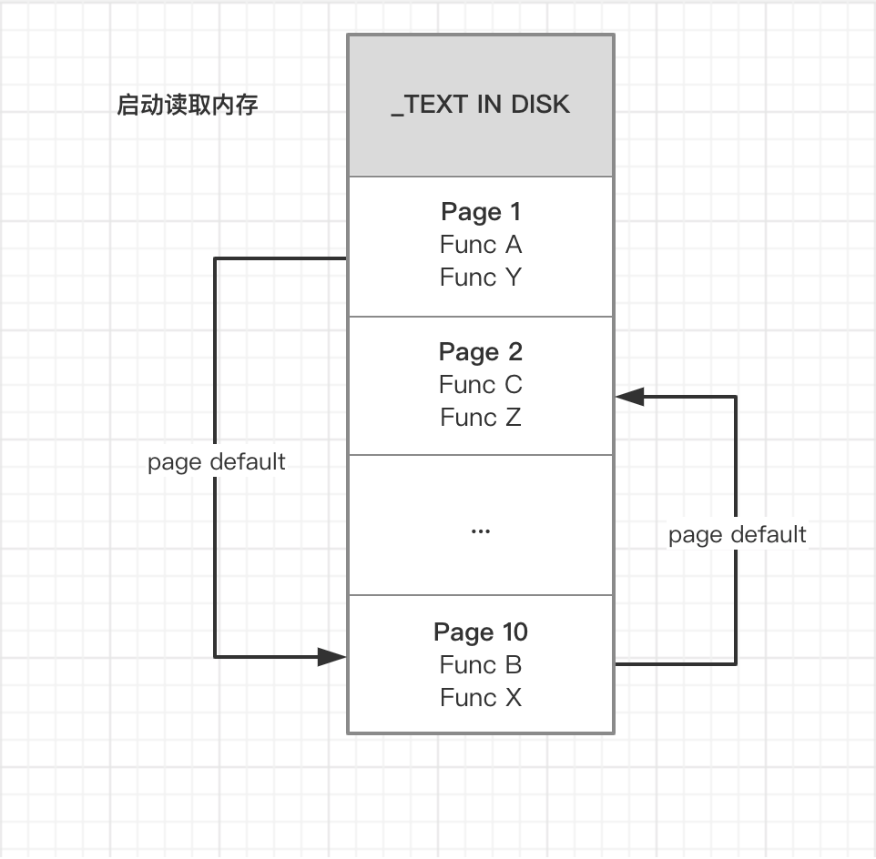

# 二进制重排

http://yulingtianxia.com/blog/2019/09/01/App-Order-Files/

https://mp.weixin.qq.com/s/YDO0ALPQWujuLvuRWdX7dQ

https://mp.weixin.qq.com/s?__biz=MzI1MzYzMjE0MQ==&mid=2247485101&idx=1&sn=abbbb6da1aba37a04047fc210363bcc9&scene=21#wechat_redirect

https://juejin.im/post/5e1280fae51d4540e47ca450

https://juejin.im/post/5e701ed5e51d4526e91f6916#heading-7

https://blog.csdn.net/shengdaVolleyball/article/details/104984267

## 介绍

去年二进制重排的概念突然火了起来，综合网上已有资料并总结实现了下，以便对启动优化有更好的了解。

### App启动和内存加载

Linux 系统下，进程申请内存并不是直接物理内存给我们运行，而是只标记当前进程拥有该段内存，当真正使用这段段内存时才会分配，此时的内存是虚拟内存。

当我们需要访问一个内存地址时，如果虚拟内存地址对应的物理内存还未分配，CPU 会执行 `page fault`，将指令从磁盘加载到物理内存中并进行验签操作（App Store 发布情况下）。

在App 启动过程中，会调用各种函数，由于这些函数分布在各个 TEXT 段中且不连续，此时需要执行多次 `page fault` 创建分页，将代码读取到物理内存中，并且这些分页中的部分代码不会在启动阶段被调用。如下图所示，假设我们在启动阶段需要调用 `Func A、B、C`，则需执行3次 `page default`(包括首次读取)，并使用3个分页。

### 如何优化？

优化的思路很简单，即把启动阶段需要用到的函数按顺序排放，减少 `page fault` 执行次数和分页数量，并使 `page fault` 在相邻页执行，如下图所示。

Xcode 的链接器提供了一个 `Order File` 配置，对应的文件中符号会按照顺序写入二进制文件中，我们可以将调用到的函数写到该文件，实现优化。

## 实现详解

### Link Map分析链接顺序

### SanitizerCoverage采集调用函数信息

Link Map 获取链接的符号顺序

SanitizerCoverage内置在LLVM中，可以在函数、基本块和边界这些级别上插入对用户定义函数的回调。详细介绍可以再 [Clang 11 documentation](http://clang.llvm.org/docs/index.html) 找到。

利用 overage sanitizer 编译器特性来获取首次使用加载了哪些内容

### 项目配置

### 结果对比

通过 system trace 前后对比

## 总结

网上还有其他方案来实现二进制重排，抖音通过手动插桩获取的符号数据会更加准确，但就其复杂度来说感觉性价比不高，而手淘的方案比较特殊，通过修改 .o 目标文件实现静态插桩，需要对目标代码较为熟悉，通用性不高。  

二进制重排相比于其他优化手段，提升效果较小，优先级较低，我们应优先从其他方面去进行启动优化，关于这部分的文章近期就会发布，敬请期待。

### About Me  🐝

今年计划完成10个优秀第三方源码解读，会陆续提交到 [iOS-Framework-Analysis](https://github.com/SimonYHB/iOS-Framework-Analysis) ，欢迎 star 项目陪伴笔者一起提高进步，若有什么不足之处，敬请告知 🏆。

### 参考

- [Improving App Performance with Order Files](https://medium.com/@michael.eisel/improving-app-performance-with-order-files-c7fff549907f)
- [[App 二进制文件重排已经被玩坏了](http://yulingtianxia.com/blog/2019/09/01/App-Order-Files/)]
- 

- [简谈二进制重排](http://www.cocoachina.com/articles/52793)

